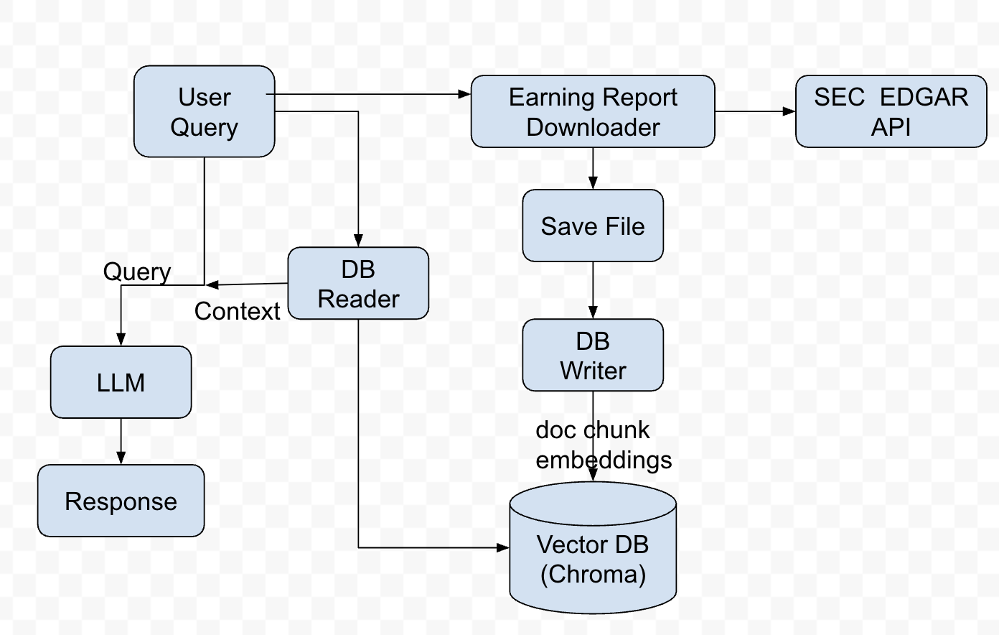

# Earning Report Analyst Agent
A practice project to build a earning report analyst agent, which can be used to answer questions about earnings report under help of [RAG](https://en.wikipedia.org/wiki/Retrieval-augmented_generation) and LLM.
It first downloads the earning report from [SEC](https://www.sec.gov), stores its chunk embeddings in [ChromaDB](https://github.com/chroma-core/chroma), uses the similarity search to query the ChromaDB, 
then passes the queried results to LLM in the format of context appended to the query, and finally returns LLM's response.

Its workflow is as follows,



## Dependency Management
Use [Conda](https://docs.conda.io/projects/conda/en/latest/user-guide/getting-started.html) to manage the environment and 3rd party libraries.
All the required dependencies are put in requirements.txt.
* Create an environment `conda create -n er python=3.12`
* Activate the environment `conda activate er`
* * Install the dependencies 
`pip3 install -r earning_report_analyst_agent/requirements.txt`

## Usage
Before running the agent, set up the environment variable `OPENAI_API_KEY`/`GOOGLE_API_KEY`/`ANTHROPIC_API_KEY`/etc 
if you want to use OpenAI/Google Generative AI/Claude/other LLM model API keys accordingly.
Check https://python.langchain.com/docs/integrations/providers/ for more information
* Run the agent `python earning_report_analyst_agent/src/app_main.py`
* Result example:
```
Based on the provided Apple Inc. Q2 2025 Form 10-Q excerpt, here are some key financial highlights:

**Income Statement Highlights (Condensed Consolidated Statements of Operations & Comprehensive Income):**

* **Strong Revenue Growth:**  Total net sales increased from $90.753 billion in Q2 2024 to $95.359 billion in Q2 2025, showing year-over-year growth.  This growth is seen in both Products and Services segments.  The six-month figures also show similar growth trends.
* **Healthy Gross Margin:**  Gross margin remained strong, though the exact percentage isn't explicitly stated, the raw numbers show a year-over-year increase.
* **Increased Net Income:** Net income rose from $23.636 billion in Q2 2024 to $24.780 billion in Q2 2025.  Six-month figures also reflect a significant increase.
* **Earnings Per Share (EPS) Growth:**  Basic and diluted EPS both increased year-over-year.
* **Other Comprehensive Income:**  Fluctuations in other comprehensive income are present, primarily driven by changes in foreign currency translation, and unrealized gains/losses on derivative instruments and marketable debt securities.  These are non-cash items and should be considered separately from net income.


**Balance Sheet Highlights (Condensed Consolidated Balance Sheets):**

* **Cash and Cash Equivalents:** While the cash and cash equivalents balance decreased slightly compared to the previous quarter (September 28, 2024), it remains substantial.
* **Marketable Securities:**  A significant portion of assets is held in marketable securities, both current and non-current.  The composition and changes in this category should be examined in detail within the full 10-Q filing.
* **Increased Accounts Payable:** Accounts payable increased significantly compared to the previous quarter.
* **Shareholders' Equity:**  Total shareholders' equity shows a year-over-year increase.


**Important Note:**  This analysis is based on *condensed* financial statements.  A complete understanding of Apple's financial performance requires a thorough review of the full 10-Q filing, including the accompanying notes, which provide crucial details and explanations of the numbers presented here.  The provided excerpt lacks crucial context and ratios that would allow for a more complete financial analysis.

```

## References:
* https://en.wikipedia.org/wiki/Retrieval-augmented_generation
* https://github.com/chroma-core/chroma
* https://www.sec.gov/search-filings/edgar-application-programming-interfaces
