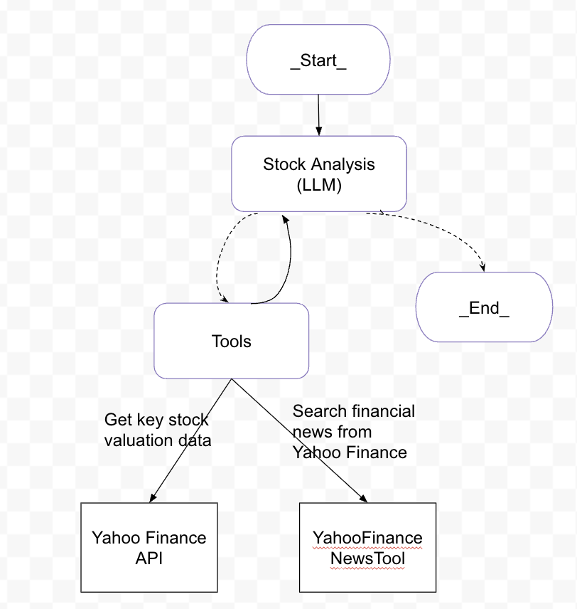

# Stock Analyst Agent
A practice project to build a stock analyst agent using [langgraph](https://www.langchain.com/langgraph), which can be used to get a stock summary according to its key valuation measures and financial news.
The agent uses ReAct architecture, which revolves around iterative cycles of thought, action, and observation.
It first uses the available tools "get_valuation_measures" and "YahooFinanceNewsTool" to get stock's current key valuation measures and financial news, respectively.
Then, it generates a clear stock summary using the user's chosen LLM model.

Its workflow is as follows:



## Dependency Management
Use [Conda](https://docs.conda.io/projects/conda/en/latest/user-guide/getting-started.html) to manage the environment and 3rd party libraries.
All the required dependencies are put in requirements.txt.
* Create an environment `conda create -n aa python=3.12`
* Activate the environment `conda activate aa`
* * Install the dependencies 
`pip3 install -r stock_analyst_agent/requirements.txt`
* To install ta-lib, follow the instructions [here](https://github.com/TA-Lib/ta-lib-python) Ex: in mac,
* *  brew install ta-lib
* *  pip3 install ta-lib

## Usage
Before running the agent, set up the environment variable `OPENAI_API_KEY`/`GOOGLE_API_KEY`/`ANTHROPIC_API_KEY`/etc 
if you want to use OpenAI/Google Generative AI/Claude/other LLM model API keys accordingly.
Check https://python.langchain.com/docs/integrations/providers/ for more information
* Run the agent `python stock_analyst_agent/src/app_main.py`
* Result example:

```
Analyze stock: hood
================================== Ai Message ==================================
Tool Calls:
  get_valuation_measures (fa962231-8113-49ff-b7cd-a831259f5096)
 Call ID: fa962231-8113-49ff-b7cd-a831259f5096
  Args:
    ticker: hood
  yahoo_finance_news (8b0288b6-09ee-4fed-aca1-73a34e3c38eb)
 Call ID: 8b0288b6-09ee-4fed-aca1-73a34e3c38eb
  Args:
    query: hood
================================= Tool Message =================================
Name: get_valuation_measures

{"Current Price": 64.93, "Market Cap": 57298710528, "PE Ratio": 37.102856, "52 Week High": 66.91, "52 Week Low": 13.98, "pe_ratio": 88.945206, "price_to_book": 7.221666, "debt_to_equity": 118.056, "profit_margins": 0.48773}
================================= Tool Message =================================
Name: yahoo_finance_news

Robinhood Stock: Top Funds Funnel Cash Into Crypto-Fueled Broker | Investor's Business Daily
After earning a spot on the list of new buys by the best mutual funds and buying crypto play WonderFi, Robinhood stock targets a breakout.

Robinhood Markets, Inc. (HOOD) Is a Trending Stock: Facts to Know Before Betting on It
Zacks.com users have recently been watching Robinhood Markets (HOOD) quite a bit. Thus, it is worth knowing the facts that could determine the stock's prospects.

HOOD vs. IBKR: Which Fintech Broker is Poised for More Growth?
As trading platforms evolve, Robinhood and Interactive Brokers stand out. Let's find out which fintech stock shows strong growth potential.

3 Financial Stocks to Buy With $3,000 and Hold Forever | The Motley Fool
Robinhood, Nu, and Coinbase are all great long-term investments.

Robinhood Markets (NasdaqGS:HOOD) Sees Q1 Revenue Surge To US$927 Million
Robinhood Markets (NasdaqGS:HOOD) recently announced significant first-quarter earnings growth, with revenue jumping to $927 million and net income reaching $336 million. These robust financial results were complemented by an increase in their share buyback program by $500 million, signaling a strong commitment to shareholder value. During this period, Robinhood's stock saw a striking 52% increase, surpassing the overall market's 5% rise in the past week and beating the 12% market growth over...
================================== Ai Message ==================================

Based on the provided data, HOOD (Robinhood Markets, Inc.) currently trades at $64.93.  The stock has seen significant price fluctuation over the past year, with a 52-week high of $66.91 and a 52-week low of $13.98.  The market capitalization is substantial at $57.3 billion.

Valuation metrics present a mixed picture. While the Price-to-Book ratio (7.22) suggests the stock may be relatively overvalued compared to its net asset value, the Price-to-Earnings ratio (PE) varies significantly depending on the calculation method (ranging from 37.10 to 88.95).  This discrepancy warrants further investigation into the different earnings calculations used.  The debt-to-equity ratio is high at 118.06, indicating a significant reliance on debt financing. Profit margins are at 0.49, suggesting a reasonable level of profitability.

Recent financial news highlights positive developments, including strong Q1 revenue growth and increased share buyback programs.  However,  it's crucial to consider the overall market conditions and the company's long-term growth prospects before making any investment decisions.  The high debt-to-equity ratio and varying PE ratios should be carefully considered in a comprehensive analysis.
```

## References:
* https://python.langchain.com/docs
* https://github.com/langchain-ai/langchain-academy
* https://langchain-ai.github.io/langgraph/
